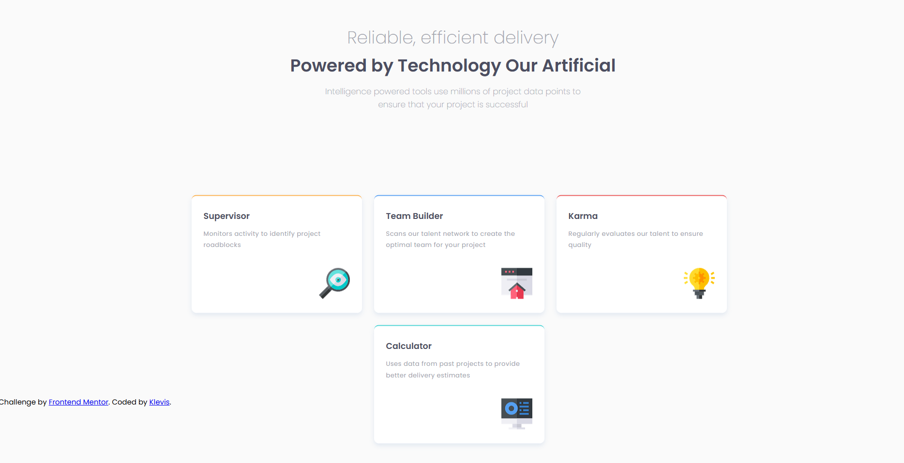

🧩 Four Card Feature Section

A responsive Four Card Feature Section built as part of a Frontend Mentor challenge.
The project focuses on creating a structured multi-column layout with four feature cards, each highlighting a different function.

🚀 Features

- Four feature cards layout
- Each card includes an icon, title, and description
- Clean multi-column responsive design
- Distinct color accents for each card
- Responsive layout (mobile → desktop)

| Technology             | Purpose                 |
| ---------------------- | ----------------------- |
| **HTML5**              | Semantic page structure |
| **CSS3**               | Styling and layout      |
| **Flexbox / CSS Grid** | Layout alignment        |
| **GitHub Pages**       | Deployment              |

📸 Screenshot

